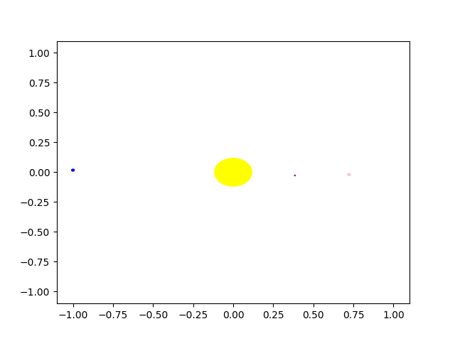

# orbits
This code simulates orbits of Solar System bodies under different theories of gravity. The orbis are stored in the 'orbits' directory.

To run the code, use:

```
   $ python simulate_orbits.py
```

You can then produce an animation from the orbits, using:

```
   $ python animate.py
```

The animation looks like this!


